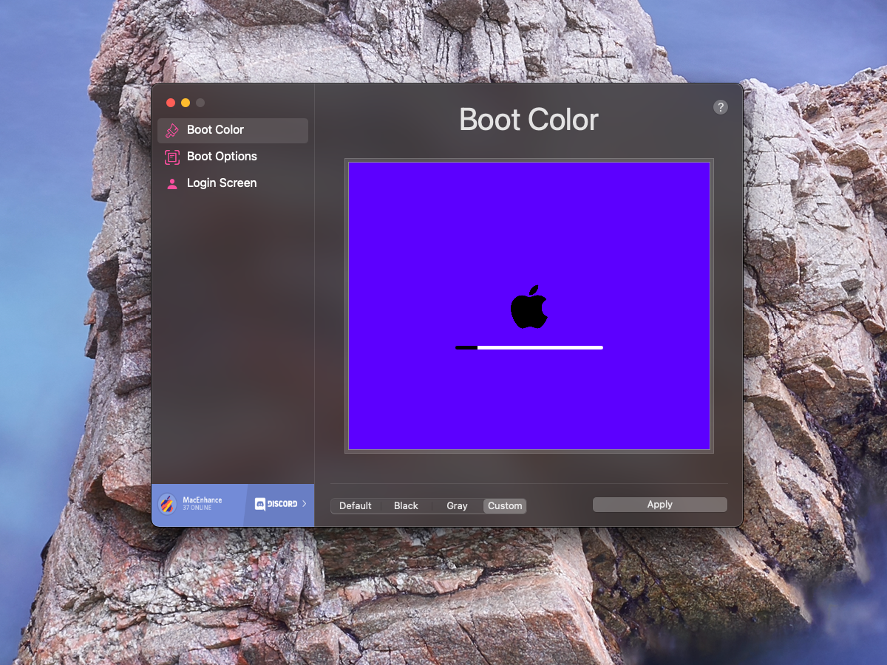

# BootBuddy

This application allows you to control the boot screen of modern macs.

### Information

 -  This should work on macOS 10.14 and above on all macs. 
 -  Submit a report [here](https://github.com/MacEnhance/BootBuddy/issues/new) if it does not.

### How to use

 -  Download the latest release: [here](https://github.com/MacEnhance/appcast/raw/master/BootBuddy.zip)
 -  Unzip the download
 -  Open `BootBuddy.app`
 -  Select the color you would like your boot screen to be and press Apply
 -  Enter your admin password and press OK
 -  **Reboot**
 
### Options

 -  Boot Color
 -  Login Screen Image
 -  Recovery Boot
 -  Verbose Boot
 -  Safe Mode Boot
 -  Single User Mode
 -  Boot Sound (2015 or older)
 -  Clamshell Mode (Laptops)
 -  Auto Boot (Laptops)

### License

Pretty much the BSD license, just don't repackage it and call it your own please!
Also if you do make some changes, feel free to make a pull request and help make things more awesome!
